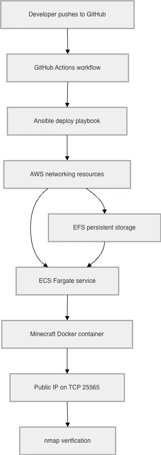

# CS 312 Course Project Part 2

This is my Part 2 submission for the Minecraft server project we've been doing throughout the term. Ansible provisions the AWS infrastructure, a Docker image runs the server on ECS Fargate, EFS holds the docker volume data and `mc.sh` commands are the only scripting I will do (locally) in my demo recording.

## Background

### What are we doing?

Getting the Minecraft server back online for Acme Corp, but automated this time.

### How are we doing it?

A small infrastructure as code script (Ansible) plus a small bash entry script. On GitHub push, the playbook creates:

> 🕺 = extra credit

* A VPC and subnet
* Security groups for ECS and EFS
* An ECS Fargate service running the `itzg/minecraft-server` Docker image (no paper mc this time) 🕺
* An EFS file system mounted at `/data` so everything survives container restarts 🕺
* A GitHub Actions workflow that does all of this on remote pushes 🕺

The server listens on TCP `25565` so we can use nmap to verify it when this is all said and done.

```bash
nmap -sV -Pn -p T:25565 instance_ip_here
```

## Requirements

| Tool | Version | Purpose |
| ---- | ------- | ------- |
| [Git](https://git-scm.com/downloads) | 2.40+ | Clone this repo |
| [Python 3](https://www.python.org/downloads/) | 3.10+ | Ansible AWS modules (`boto3`, session-token auth) |
| [Ansible](https://docs.ansible.com/ansible/latest/installation_guide/intro_installation.html) | 2.14+ | Run the provisioning playbooks |
| [AWS CLI](https://docs.aws.amazon.com/cli/latest/userguide/getting-started-install.html) | v2 | ECS status lookups and public IP refresh in `./mc.sh restart` |
| [nmap](https://nmap.org/download.html) | 7.90+ | Verify the server is running |
| [Bash](https://www.gnu.org/software/bash/) | 5.0+ | Run `./mc.sh` |

Ansible's AWS modules need `boto3` in whatever Python interpreter Ansible picks. On my Mac that's a project venv and not any system installed Python. That's why `./mc.sh deploy` runs `ansible-galaxy collection install` for `amazon.aws` and `community.aws` on first use.

```bash
python3 -m venv .venv
source .venv/bin/activate
pip install -r requirements.txt
```

Keep the venv active for every `./mc.sh` command. `requirements.txt` pins `boto3` and `awscrt`. The latter is required for AWS Academy session-token auth.

### AWS Credentials

>[!NOTE]
> If you're following this tutorial for the class, I'm assuming you already have an AWS Academy Learner Lab account with `LabRole`. That's the role this project uses for ECS task execution. The AWS Academy Learner Lab doesn't let us create our own IAM roles.

Get your credentials from the lab page, copy the example file and paste your keys into `.env.aws` (same `export` format as `.env.aws.example`):

```bash
cp .env.aws.example .env.aws
```

`./mc.sh` sources `.env.aws` on every command. You can also export the same three variables in your shell instead.

>[!CAUTION]
> If a command fails with an auth error, grab fresh credentials from the lab page and update `.env.aws`. Same idea for GitHub Actions secrets if you're using the full workflow.

## Architecture

<picture>
  <source media="(prefers-color-scheme: dark)" srcset="public/fun.webp">
  <source media="(prefers-color-scheme: light)" srcset="public/fun-light.webp">
  
</picture>

## Helpful commands

| Stage | Command | What it does |
| ----- | ------- | ------------ |
| 1 | `./mc.sh deploy` | Provision AWS and start the server |
| 2 | `./mc.sh test` | Run the nmap scan on port `25565` to verify the server is running (personal helper) |
| 3 | `./mc.sh restart` | Stop the ECS task, confirm a replacement comes up |
| 4 | `./mc.sh destroy` | Delete everything (personal helper) |

>[!IMPORTANT]
> For steps 2 and 4, I created personal helper scripts to make the process easier, they're not actually required for you to replicate this on your own machine! However, you would need to ensure that you have the correct tools installed and that your AWS credentials are set up correctly. And once the server is running, you'll need to delete everything manually if you elect not to use the `./mc.sh destroy` command.


## Running the pipeline

Clone the repo, set up credentials and create the Python venv:

```bash
git clone https://github.com/blumhouse/312.git
cd 312
cp .env.aws.example .env.aws

python3 -m venv .venv
source .venv/bin/activate
pip install -r requirements.txt
```

Deploy:

```bash
./mc.sh deploy
```

>[!NOTE]
> This runs `ansible/deploy.yml` (default VPC → security groups → EFS → ECS). The public IP shows up at the very end of the Ansible output as `minecraft @ x.x.x.x:25565`. Ansible also writes it to `.mc-public-ip` for `./mc.sh test`.

Verify with nmap:

```bash
./mc.sh test
```

>[!CAUTION]
> The Minecraft container can take a couple minutes to finish starting after ECS reports the task as running. `./mc.sh test` reads `.mc-public-ip` and runs the same `nmap -sV -Pn -p T:25565` scan from the [Background](#background) section. If the port is closed, wait a minute and try again. The container is probably still booting.

Restart test (what I show in the recording):

```bash
./mc.sh restart
```

This stops the current ECS task, waits for a replacement, refreshes the public IP and runs the nmap scan again.

Tear down when you're done (optional):

```bash
./mc.sh destroy
```

This runs `ansible/destroy.yml` and removes the ECS service, cluster, EFS and security groups. If `mcsg` fails to delete on the first try, AWS is usually still releasing the Fargate network interface. The playbook ignores that error and you can re-run destroy after a minute if the group is still there.

## How to connect in Minecraft (optional)

After `./mc.sh deploy`, scroll to the bottom of the Ansible output and copy the IP from the `minecraft @ x.x.x.x:25565` line (or read `.mc-public-ip`). Open Minecraft → **Multiplayer** → **Add Server** → paste the IP → **Join Server**. If you don't want to connect in Minecraft, skip this and just run `./mc.sh test`.

## GitHub Actions

The workflow at `.github/workflows/deploy.yml` runs on pushes to `main`. It installs Ansible and nmap on the runner, then runs `./mc.sh deploy` and `./mc.sh test`, the same deploy-and-verify flow as local.

> [!CAUTION]
> Make sure to add your current lab credentials as repository secrets before pushing if you wanna test the workflow:
> ```bash
> AWS_ACCESS_KEY_ID: paste-from-lab-page
> AWS_SECRET_ACCESS_KEY: paste-from-lab-page
> AWS_SESSION_TOKEN: paste-from-lab-page
> ```


## Sources

References I used while building this, grouped by what they helped with.

### Course and documentation

* [GitHub markdown syntax](https://docs.github.com/en/get-started/writing-on-github/getting-started-with-writing-and-formatting-on-github/basic-writing-and-formatting-syntax)
* [GitHub README `<picture>` for theme-aware images](https://docs.github.com/en/get-started/writing-on-github/getting-started-with-writing-and-formatting-on-github/basic-writing-and-formatting-syntax#the-picture-element)

### Ansible

* [Ansible documentation](https://docs.ansible.com/)
* [Ansible playbooks](https://docs.ansible.com/ansible/latest/playbook_guide/playbooks_intro.html)
* [Amazon AWS collection](https://docs.ansible.com/ansible/latest/collections/amazon/aws/) (VPC, subnets, security groups)
* [Community AWS collection](https://docs.ansible.com/ansible/latest/collections/community/aws/) (ECS, EFS)

### AWS

* [Amazon VPC](https://docs.aws.amazon.com/vpc/latest/userguide/what-is-amazon-vpc.html)
* [ECS on Fargate](https://docs.aws.amazon.com/AmazonECS/latest/developerguide/AWS_Fargate.html)
* [ECS task definitions](https://docs.aws.amazon.com/AmazonECS/latest/developerguide/task_definitions.html)
* [ECS services and task replacement](https://docs.aws.amazon.com/AmazonECS/latest/developerguide/ecs_services.html)
* [EFS volumes in ECS tasks](https://docs.aws.amazon.com/AmazonECS/latest/developerguide/efs-volumes.html)
* [ECS task execution IAM role](https://docs.aws.amazon.com/AmazonECS/latest/developerguide/task_execution_IAM_role.html) (`LabRole` in Learner Lab)
* [AWS CLI authentication](https://docs.aws.amazon.com/cli/latest/userguide/cli-chap-authentication.html)

### Docker, verification and CI

* Preffered [`itzg/docker-minecraft-server`](https://github.com/itzg/docker-minecraft-server) over PaperMC because of the EULA ease of use.
* [nmap reference](https://nmap.org/book/man.html)
* [GitHub Actions workflows](https://docs.github.com/en/actions/using-workflows/workflow-syntax-for-github-actions)
* [`aws-actions/configure-aws-credentials`](https://github.com/aws-actions/configure-aws-credentials)
